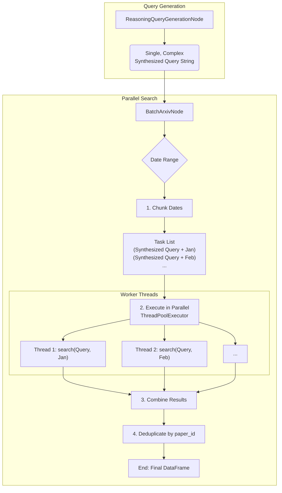

# Research Assistantに関する技術的知見

このドキュメントは、Research Assistantモジュールの実装に関する重要な技術的判断やアーキテクチャ上の特徴を記録します。

## `BatchArxivNode`における並列検索アーキテクチャ

Research Assistantのコア機能の一つであるarXivからの論文検索は、パフォーマンス向上のために並列処理を採用しています。しかし、その実装方法には重要な特徴があります。

### 並列化の対象：「単一の合成クエリ」の時間軸分割

一見すると、システムはユーザーの意図から生成された「複数の検索クエリ」をそれぞれ並列に実行しているように見えるかもしれません。しかし、実際のアーキテクチャは異なります。

1.  **クエリの合成**: `ReasoningQueryGenerationNode`は、ユーザーの意図を分解して得られた複数の検索条件（例: "GraphRAG", "Ontology-based RAG", "multi-agent systems AND RAG"など）を、最終的に**`OR`で連結した単一の巨大なクエリ文字列**に合成します。

2.  **時間軸での並列化**: `BatchArxivNode`は、この合成された**単一のクエリ文字列**を受け取ります。そして、このクエリを使い、指定された検索期間（例: 2023-01-01から2024-01-01）を月単位などのチャンクに分割します。並列処理は、この**分割された期間ごと**に行われます。

結論として、このシステムは「複数の異なるクエリを並列実行」しているのではなく、「**単一の合成クエリを、時間軸で分割して並列実行**」しています。このアプローチは、arXiv APIの強力なクエリ言語を最大限に活用し、一度の検索（の並列版）で多様な論文を効率的に取得するための設計です。

### アーキテクチャ図

